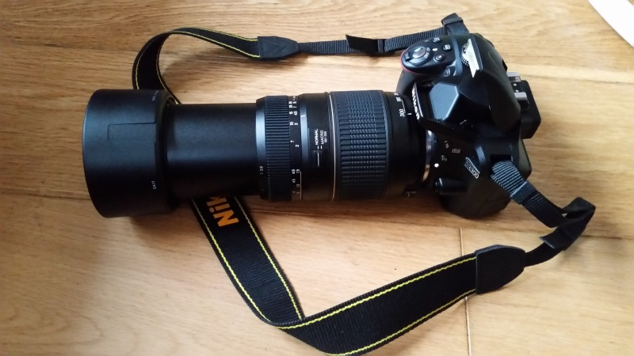

+++
date = "2016-12-22T12:56:02Z"
draft = false
title = "2016 Round-Up"
description= ""
categories= ["2016","roundup","List of things"]
+++

So another year draws to a close and I thought I would review the last 12 months in my favourite data struture; lists.  Think of this as a far less interesting homage to [Fogus](http://blog.fogus.me/2015/12/29/the-best-things-and-stuff-of-2015/) yearly reviews. 

## Books
### Technical
Over the last few years I consume less technical books purely because the content to be found online can be of great quality and books can rarely keep track with the rate of change in tech.  Usually if I am reading a tech book its of a more abstract or fundamental topic rather than specific to a language and is therefore a longer living.

  - [The Architcture of Open Source Applications](http://aosabook.org/en/index.html) - Various  
  - [The Architcture of Open Source Applications, Volume II](http://aosabook.org/en/index.html) - Various  
  - [The Performance of Open Source Applications](http://aosabook.org/en/index.html) - Various  
  - [Code: The Hidden Language of Computer Hardware and Software](http://amzn.to/2ij9qUH) - Charles Petzold 

### Non Technical
Most people hate commuting but it allows me to consume audiobooks and podcasts at a rate that would be impossible otherwise.  Almost all of these were "read" via audiobook:

  - [The Passage of Power](http://amzn.to/2i59Cbd) - Robert A. Caro  
  - [The Age of Innocence](http://amzn.to/2hKJc0r) - Edith Wharton  
  - [Seveneves](http://amzn.to/2hWIivM) - Neal Stephenson  
  - [One Hundred Years of Solitude](http://amzn.to/2hghrht) - Gabriel Garcia Marquez  
  - [To Kill a Mockingbird](http://amzn.to/2hKLQ6p) - Harper Lee  
  - [The Name of the Wind](http://amzn.to/2i54Lqu) - Patrick Rothfuss  
  - [The Wise Man's Fear](http://amzn.to/2if8u7R) - Patrick Rothfuss  
  - [Anathem](http://amzn.to/2if3v7h) - Neal Stephenson  
  - [Influence: The Psychology of Persuasion](http://amzn.to/2ieXtUe) - Robert B. Cialdini  
  - [Wolf Hall](http://amzn.to/2ifeqxG) - Hilary Mantel  
  - [Bring Up the Bodies](http://amzn.to/2hYLQjT) - Hilary Mantel  
  - [iWoz](http://amzn.to/2ij81hh) - Steve Wozniak  
  - [Quiet: The Power of Introverts in a World That Can't Stop Talking](http://amzn.to/2if5VTr) - Susan Cain  
  - [Harry Potter and the Methods of Rationality](http://hpmor.com/) - Eliezer Yudkowsky  

Not listed are about 10 other books that I abandoned at the 10% mark, I used to stick with a bad book to the bitter end but not anymore.

Next up is [The Gene: An Intimate History](http://amzn.to/2hKULoh) - Siddhartha Mukherjee as soon as I finish The Passage of Power.

## Blog posts
### Technical
  - [Aphyr - Jepsen series](https://aphyr.com/tags/Jepsen) - Interesting set of posts on distributed systems and how they fail.  The Redis   one is particularly interesting if you are into the realities of Consistent, Available or Partition consistent distributed systems, and hey who isnt.  
  - [My first 10 minutes on a server](http://www.codelitt.com/blog/my-first-10-minutes-on-a-server-primer-for-securing-ubuntu/)  
  - [MS - Introducing .NET standard](https://blogs.msdn.microsoft.com/dotnet/2016/09/26/introducing-net-standard/) - Microsoft have gone   from being a non participant in the opens source world to one of its biggest players. The feat of engineering involved and the planning   it required is stunning.  This blog gave a taste of that new direction.  
  - [F# for Fun and Profit](https://fsharpforfunandprofit.com/posts/how-types-work-with-functions/) - I started a slightly more concerted   effort to learn F# properly this year and wrote some simple apps (web crawlers, epub generators etc).  This website was hugely helpful and well worth checking out.  
  - [The Quiet Crisis unfolding in Software Development](https://medium.com/@billjordan1/the-quiet-crisis-unfolding-in-software-development-cffbdafbf450#.tser0a9b3)  
  - [Who Will Command The Robot Armies?](http://idlewords.com/talks/robot_armies.htm)  
  - [Managing technical debt](https://18f.gsa.gov/2015/10/05/managing-technical-debt/)  
  - [My Biggest Regret As A Programmer](http://thecodist.com/article/my-biggest-regret-as-a-programmer)  
  - [Bayes's Theorem: What's the Big Deal?](https://blogs.scientificamerican.com/cross-check/bayes-s-theorem-what-s-the-big-deal/)  
  - [H.264 is magic](https://sidbala.com/h-264-is-magic/)  
  - [You Are Not Paid to Write Code](http://bravenewgeek.com/you-are-not-paid-to-write-code/)  
  - [How it feels to learn JavaScript in 2016](https://hackernoon.com/how-it-feels-to-learn-javascript-in-2016-d3a717dd577f#.6y2emclav)  
  - [THE DAY I PARSED A MONSTER](http://www.empear.com/blog/parse-a-monster/)  
  - [Fizz Buzz in Tensorflow](http://joelgrus.com/2016/05/23/fizz-buzz-in-tensorflow/)  
  - [Uniqueness and Reference Immutability for Safe Parallelism](https://www.microsoft.com/en-us/research/publication/uniqueness-and-reference-immutability-for-safe-parallelism/)  

### Non Technical  
  - [He Always Had a Dark Side](https://magazine.atavist.com/he-always-had-a-dark-side)  
  - [A Protocol for Dying](http://hintjens.com/blog:115)  
  - [MEDITATIONS ON MOLOCH](http://slatestarcodex.com/2014/07/30/meditations-on-moloch/)  
  - [The Gods of the Copybook Headings](http://www.kiplingsociety.co.uk/poems_copybook.htm)  
  - [FRACTURED LANDS: HOW THE ARAB WORLD CAME APART](http://www.nytimes.com/interactive/2016/08/11/magazine/isis-middle-east-arab-spring-fractured-lands.html?_r=0)    
  - [In the Beginning Was The Command Line](http://artlung.com/smorgasborg/C_R_Y_P_T_O_N_O_M_I_C_O_N.shtml)  
  - [Scott Aaronson Answers Every Ridiculously Big Question I Throw at Him](https://blogs.scientificamerican.com/cross-check/scott-aaronson-answers-every-ridiculously-big-question-i-throw-at-him/)    
  - [Classic Programmer Paintings](http://classicprogrammerpaintings.com/)  

## Music
I discovered almost no new music this year apart from a handful of albums.  

  - The Black Keys - Their discography has been my background music for at least 2 years.  Its on shuffle as I work almost constantly.    
  - Radiohead - See above  
  - Andrew Bird  
  - Beck  
  - Ben Howard  
  - Chris Stapleton - I'm not a country fan at all but this dude has a great voice.  
  - Daft Punk  
  - Gary Clark Jr - Awesome  
  - Kaleo  
  - LCD Soundsystem  
  - Raising Sand - Robert Plant and Alison Krauss - This one has been out a few years and I never got to it before now.  
  - The White Stripes   

## Podcasts
Only two worth mentioning this year:  

  - Hardcore History - Dan Carlin - Been listening to Dan for a few years now. He drops 3-4 audiobook length podcasts each year which are   interesting both from a historical context but also in Dans perspective on how events happened.  
  - Robert B. Peterson Podcast - This is pretty new, only started listening a week ago and only 2 episodes are up but the content is great.  It seems to be a slight reworking of his Maps of Meanings lecture series into podcast form. Well worth checking out if you are interested in Psychology, Mythological Archtypes, Parenting and the realities of being a limited being.    

## TV Shows 
Too many to list but here are the best ones:  

  - Olive Kitteridge (HBO) - Set in Maine with Frances McDormand and Bill Murray.  Interesting look at life, depression, repression.  
  - Mr. Robot - Loved season 1, not so much Season 2.  
  - Jessica Jones  
  - The Walking Dead - I think this is like season 6 of a show centered around a simple core concept: "We have to survive".  But whatever,     Zombies!  
  - Westworld - Awesome, need to rewatch, best show I have seen for a long time.  
  - Veep - Really enjoyed this.  
  - The Night Of - Excellent  
  - Peaky Blinders - "Tommy FOCKIN Shelby"  
  - Always Sunny in Philadelphia - Excellent  
  - Narcos - Excellent  
  - Planet Earth 2 - David Attenborough and HD nature shots   

On my list to watch:  

  - Stranger Things - Seen 1 episode and enjoyed it.  
  - Black Mirror - Ditto  

## Films enjoyed
Too many to list but here are the best ones:   

  - Nocturnal Animals - Sparked a lot of conversation this one.  
  - The Martian - Loved the book and the Movie.  
  - The secret Life of Pets - Greate family Movie.  
  - Finding Dory - Where the hell is she.  

## Youtube stuff

  - [Primitive Technology](https://www.youtube.com/channel/UCAL3JXZSzSm8AlZyD3nQdBA) - Dude in the outback recreating primitive tools and objects.  I watch this with my son and he loves it.
  - [Jordan B Peterson](https://www.youtube.com/user/JordanPetersonVideos) - Professor of Psychology at the university or Toronto, highly articulate and engaging speaker with well thought out arguments.  I might not agree with everything he says but he covers several fundamental ideas. 
  - [Marques Brownlee](https://www.youtube.com/user/marquesbrownlee) - Dope tech reviews, possibly the only reviewer I gave seen who can edit and compose a shot worth looking at.
  - [The Great War](https://www.youtube.com/user/TheGreatWar) 
  - [Alt Shift X](https://www.youtube.com/user/JaiWbio) - Game of Thrones fans already know about this guy, great analysis videos.
  
## Technical stuff encountered
### Work related
  - C# .NET
  - [C4 architecural diagrams](http://www.codingthearchitecture.com/2014/08/24/c4_model_poster.html) - Been using this for a while but it   became my main visual explanation method this year.  
  - Powershell  
  - [Event Driven Architecture](https://en.wikipedia.org/wiki/Event-driven_architecture) - Loosely coupled, message oriented, queue based.  
  - REST APIs   

### Playtime related
  - .NET Core, .NET standard
  - F#  
  - Javascript  
  - Rust  
  - Node  

### Stuff I wanted to do or learn but have not spent enough time on yet
  - More Arduino - I have tons of components waiting to be used in a crappy project that will kinda half work.  
  - Teaching the kids programming - Starting to feel guilty about this one as it would be a great skill for them to learn.  It is the   modern equivalent of literacy to some degree.  
  - Drones  
  - Photography  
  - Procedural generation  
  - Running

## Opensource code read
Reading code wrtten by other developers is a great way to learn new techniques and patterns. 

  - https://github.com/dotnet/BenchmarkDotNet  
  - https://github.com/vadixidav/evobots  
  - https://github.com/nightscout/cgm-remote-monitor  
  - https://github.com/aosabook/500lines  
  - https://github.com/structurizr/dotnet  
  - https://github.com/reactjs/redux  
  - https://github.com/dotnet/coreclr  
  - https://github.com/AutoMapper/AutoMapper  
  - https://github.com/dotnet/roslyn  

## Things I bought that had an impact.  
  - [Bose QC35](http://amzn.to/2h5UaJY) - I work in an Agile space, which basically means I sit in a big room with lots of other people and no partitions.  People can be noisy, to help fix this most companies use a whitenoise generator which helps reduce noise by creating more noise.  So yea I bought some noise cancelling headphones, silence is my drug of choice.
  - [Nikon DSLR](http://amzn.to/2hZ7YdV) - I bought an entry level DSLR and some lenses with the goal of taking some better pictures of the kids as they grow up but also to try my hand at Astrophotography.

## Countries visited
### USA - Maine
We were very fortunate to get to spend an extended period of time in Portland Maine this summer!  Beautiful spot and great people.

## Plans for 2017
  - Read 50 books  
  - Learn a programming language  
  - Build a meaningful product  
  - Have fun!
