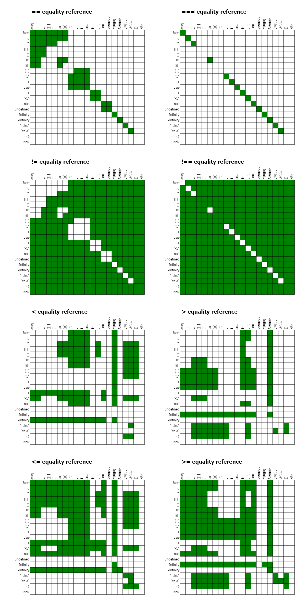

+++
date = "2015-02-17T12:52:32Z"
title = "Javascript Equality Operator Grids"
description= "== vs === vs < vs > vs != vs !== vs <= vs >="
categories= ["javascript","equality","jsfiddle"]
+++

Javascript gets some bad press these days especially over how its comparison operators work. 

I decided to extend [Craig Gidneys](http://strilanc.com/visualization/2014/03/27/Better-JS-Equality-Table.html) example and added ===, !=, !== <, <=, > and .= comparisons. 

Rows are the left side operand and columns are the right.

[Source code on jsfiddle](https://jsfiddle.net/SecretDeveloper/1zywbpLL/)

