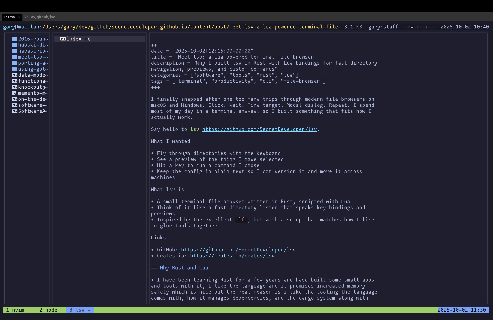

+++
date = "2025-10-02T12:15:00+00:00"
title = "lsv: a Lua powered terminal file browser"
description = "Why I built lsv in Rust with Lua bindings for fast directory navigation, previews, and custom commands"
categories = ["software", "tools", "rust", "lua"]
tags = ["terminal", "productivity", "cli", "file-browser"]
+++

I finally snapped after one too many trips through modern file browsers on macOS and Windows. Click. Wait. Tiny target. Modal dialog. Repeat. I spend most of my day in a terminal anyway, so I built something that fits how I actually work.

Say hello to [lsv](https://github.com/SecretDeveloper/lsv).
- GitHub: https://github.com/SecretDeveloper/lsv
- Crates.io: https://crates.io/crates/lsv

## What I wanted

- Fly through directories with the keyboard
- See a preview of the thing I have selected
- Hit a key to run a command I chose
- Keep the config in plain text so I can version it and move it across machines

## What lsv is

- A small terminal file browser written in Rust, scripted with Lua
- Think of it like a fast directory lister that speaks key bindings and previews
- Inspired by the excellent `lf`, but with a setup that matches how I like to glue tools together

## Why Rust and Lua

- I have been learning Rust for a few years and have built some small apps and tools with it, I like the language and it promises increased memory safety which is nice but the real reason is i like the tooling the language comes with, how it manages dependencies, and the cargo system along with crates.io for distribution.
- Lua keeps the configuration simple and flexible without writing a plugin system

## How I use lsv

You can bind keys to run shell command. `e` for example might launch the selected file in your `$EDITOR` or i use `t` to launch a new tmux pane for the current directory, or `gs` which is bound to `lsv.os_run("git status -C {current_dir}")` to see the results in a results window. 

It just gives you fast navigation and a place to launch the tools you already use.

## Little things that help

- Show hidden files toggle with `zh`
- Sorting by name, size, created with `sn`, `ss`, `sc`.
- Sensible defaults out of the box so you can start without touching config
- You can configure themes by placing them in your `$LSV_CONFIG_DIR/themes` folder and lsv will detect them.  Set the team using `Ut` to open the theme selector.  I have created some already.   

## Why not just use lf

lf is great. I borrowed a few ideas and then went in a direction that fit my preferences. Rust for the core. Lua instead of a domain specific config. Some different choices around previews and key dispatch. If you are happy with lf then keep using it. If you want a Lua flavored setup, give lsv a try.

## Install and configuration

- With cargo: `cargo install lsv`
- Copy the `https://github.com/SecretDeveloper/lsv/tree/main/examples/config` content to your `~/.config/lsv/` folder or wherever you have set the `LSV_CONFIG_DIR` environment variable to.  
- Edit init.lua previews and key_actions as you wish.

If you try it and it makes your day a little smoother, that is a win. If something feels rough, open an issue and tell me what got in your way.

