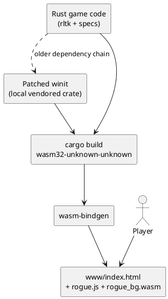

+++
date = "2026-02-06T18:00:00+00:00"
title = "Making a Rust Roguelike Work in the Browser"
description = "The roguelike already ran on desktop. The browser version took a different kind of work: dependency pinning, wasm-bindgen, a patched windowing crate, and a better shell around the canvas."
draft = false
categories = ["software", "games", "rust"]
tags = ["wasm", "webassembly", "game-dev", "roguelike", "browser", "ai-assisted-development"]
series = ["Working with AI"]
+++

I have a Rust roguelike that ran on desktop. I wanted it to run in the browser as well.

That sounds straightforward until you actually try it.

The game itself was not really the hard part. It already existed. The work was in getting the build chain, the dependencies, and the browser shell to agree on what “working” meant.

You can see the code and the working game, and the original tutorial which is really good:

- Repo: [SecretDeveloper/rogue](https://github.com/SecretDeveloper/rogue)
- Playable browser version on this site: [Rogue](/games/rogue/)
- Tutorial the project follows: [Rust Roguelike Tutorial](https://bfnightly.bracketproductions.com/)
- Earlier overview post: [Rogue in Rust with ECS + WebAssembly](/posts/rogue-ecs-wasm-tutorial/)

## Build path

## The game was already there

This repo started as my pass through the Rust roguelike tutorial. The core of it uses `rltk`, `specs`, `serde`, `regex`, and the usual bits you would expect from that stack.

By the time I came back to it for the web build, the game loop and ECS side of things were already in place. What was missing was a path from “cargo run opens a native window” to “this is something I can load in a page and play”.

## WebAssembly was not the main problem

The basic build path is simple enough.

The repo now has a `build_js.sh` script that does four things:

- make sure the `wasm32-unknown-unknown` target is installed
- build the Rust project for that target
- make sure `wasm-bindgen-cli` is installed
- generate the JS bindings and drop the output into `www`

Once the pieces line up, `wasm-bindgen` will generate the JS bindings required to allow the Rust code to be executed.

## Old dependencies tend to stay old in awkward ways

This project follows an older tutorial, and older tutorials have a habit of freezing a dependency graph in amber.

The README in the repo already had some notes about that. `rltk` pulls in `bracket-lib`, which pulls in `bracket-terminal`, which eventually drags in older versions of `glow` and windowing code. That all made sense at the time the tutorial was written. It made less sense on a newer toolchain, particularly once I started caring about a browser target.

## The `winit` patch was the real friction point

macOS builds had started breaking because of newer Rust expectations around Cocoa `BOOL` handling, so I patched a few locations to use `bool` correctly and cleaned up some crate-level warnings at the same time.

## What changed once it ran in the browser

The main thing that changed is that the project became easier to share.

A desktop build is fine for my own machine. A browser build is much better for sending someone a link and letting them just try it.

That sounds obvious, but it shifts the value of the project quite a bit. Once it lives on a page, the work around presentation, layout, controls, and first impressions starts to matter more.
